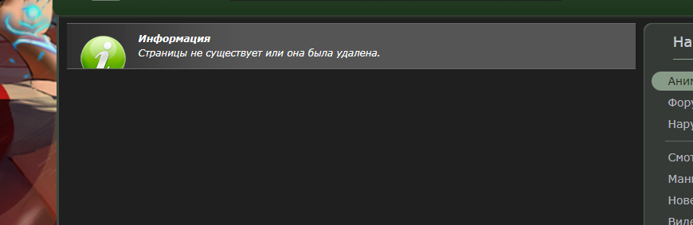

# jut.su_next-series

Chrome Extension for the site "jut.su" which makes auto-transition to the next series after the end of the current one

## How to install/use extension

1. Install zip and unpack to a convenient location
2. Open the chrome://extensions page.
3. Turn on developer mode in the top right corner.
4. Click Load unpacked extension.
5. Find and select the extension folder.

## Some Error

1.  Switching to a non-existent series
    

    The site itself solved this problem, it simply writes that the series does not exist or it has been deleted.

2.  Console error after page reload  
    

    Due to Google's policy that video autoplay does not work before the user has interacted with the site.

    After reloading the page, video autoplay does not work. But the next series will start.
