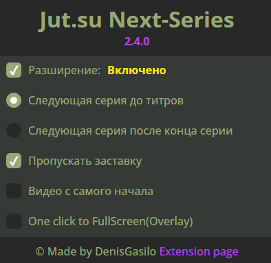

   
   <h1>jut.su Next-Series V2.4.0 Beta</h1>

   

## Description

Chrome extension for [Jut.su](https://jut.su/) which makes video auto-play, auto-skip anime intro, and auto-open next series after the end of the current one.

If you want the anime to go full screen automatically, I made a [python script](https://github.com/DenisGas/watch_jut.su) that does that.

## Features:

- Automatically plays video ✌️
- Automatically skip anime intro 🔥
- Open next episode 🤩
- One click to FullScreen(Overlay) 👍
- Video hotkey work (Press "F" to fullScreen) ❤️

## Installation

[download from chrome store](https://chromewebstore.google.com/detail/jutsu-next-series/godmnckhgkgojikjpiahppfnmhgkfpjp)

## Usage

### Phone

To use the extension on your phone, you can use the [Kivi Browser](https://play.google.com/store/apps/details?id=com.kiwibrowser.browser&pcampaignid=web_share).

### PC

1. "Разширение: Включено/Выключено" - ON/OFF extension
2. "Следующая серия до титров" - auto-transition to the next series on credits, before the video end.
3. "Следующая серия после конца серии" - auto-transition to the next series after the video end.
4. "Пропускать заставку" - skip anime intro.
5. "Видео с самого начала" - starts the series from the beginning
6. "One click to fullScreen" - create overlay which, when clicked, opens the video in full screen.

## What I Want to Implement

- Кросбраузерность версию для (фаерфокс)
- локализацию и возможность выбора любого языка
- настройку шорткатов  

## Some Issues

-  After reloading the page, the autoplay video does not work
   
    - **Console error**\
       

       Due to Google's policy that video auto-play does not work before the user has interacted with the site.

       After reloading the page, video auto-play does not work.
    
    - **Fix**
       Also, if you make a [PWA from the site](https://support.google.com/chrome_webstore/answer/3060053#zippy=%2Cadd-an-app-from-the-chrome-web-store), even after restarting the site, autoplay will work (checked Chrome and Edge)

## Known Issues

Please check the [GitHub Issues](https://github.com/DenisGas/jut.su_next-series/issues) for known issues and report any new ones you come across.