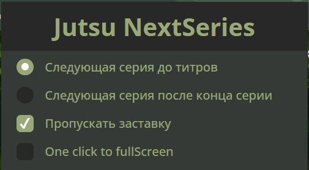
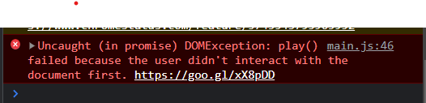

# jut.su Next-Series V2.4.0 Beta

Chrome extension for [Jut.su](https://jut.su/) which makes video auto-play, auto-skip anime intro, and auto-open next series after the end of the current one.

if you want the anime to go full screen automatically, i made a [python script](https://github.com/DenisGas/watch_jut.su) that does that 

## Features:

- Automatically plays video ✌️
- Automatically skip anime intro 🔥
- Open next episode 🤩
- One click to FullScreen(Overlay) 👍
- Video hotkey work (Press "F" to fullScreen) ❤️

## How to install/use extension

To use the extension on your phone, you can use the kiwi browser.

### Install (Chrome store)

[download from chrome store](https://chrome.google.com/webstore/detail/jutsu-next-series/godmnckhgkgojikjpiahppfnmhgkfpjp/related?hl=en)

### Use

1. "Следующая серия до титров" - auto-transition to the next series on credits, before the video end.
2. "Следующая серия после конца серии" - auto-transition to the next series after the video end.
3. "Пропускать заставку" - skip anime intro.
4. "Видео с самого начала" - starts the series from the beginning
5. "One click to fullScreen" - create overlay which, when clicked, opens the video in full screen.

## Some Error

1.  Console error after page reload  
    

    Due to Google's policy that video auto-play does not work before the user has interacted with the site.

    After reloading the page, video auto-play does not work. But the next series will start.
