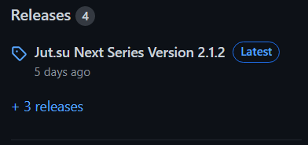
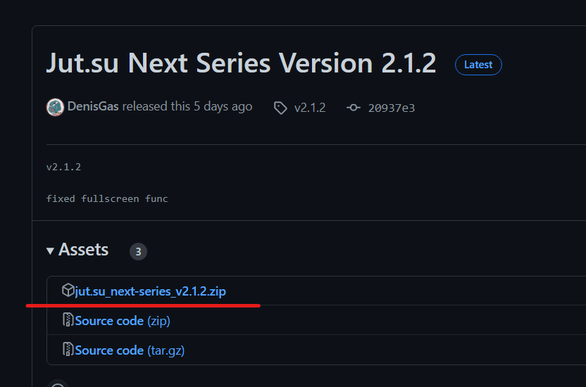

# jut.su_next-series

Chrome Extension for the site "jut.su" which makes video auto-play and auto-transition to the next series after the end of the current one.

## How to install/use extension

To use the extension on your phone, you can use the kiwi browser.

### Install

1. Install zip and unpack to a convenient location.

   Click on latest release.
   
   
   
   Click on jut.su_next-series_v*.zip file (not source code).
   
   

2. Open the chrome://extensions page.
3. Turn on developer mode in the top right corner.
4. Click Load unpacked extension.
5. Find and select the extension folder.

### Use

1. "Следующая серия до титров" - auto-transition to the next series on credits, before the video end.
2. "Следующая серия после конца серии" - auto-transition to the next series after the video end.
3. "Пропускать заставку" - skip anime intro.
4. "One click to fullScreen" - create overlay which, when clicked, opens the video in full screen.

## Some Error

1.  Console error after page reload  
    

    Due to Google's policy that video auto-play does not work before the user has interacted with the site.

    After reloading the page, video auto-play does not work. But the next series will start.
