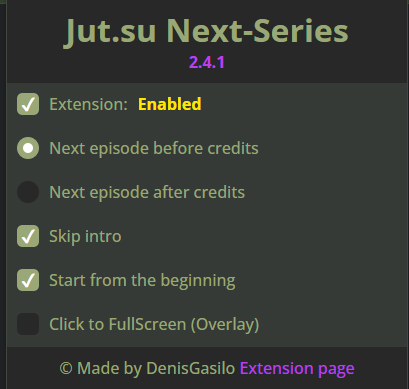
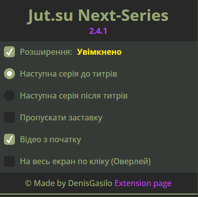
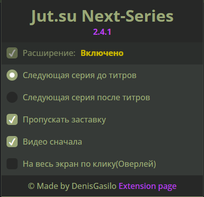

   
   <h1>jut.su Next-Series V2.4.1</h1>

   

## Description

Chrome extension for [Jut.su](https://jut.su/) which makes video auto-play, auto-skip anime intro, and auto-open next series after the end of the current one.

If you want the anime to go FullScreen automatically, I made a [python script](https://github.com/DenisGas/watch_jut.su) that does that.

## Features:

- Automatically plays video ✌️
- Automatically skip anime intro 🔥
- Open next episode 🤩
- One click to FullScreen(Overlay) 👍
- Video hotkey work (Press "F" to fullScreen) ❤️

## Installation

[download from chrome store](https://chromewebstore.google.com/detail/jutsu-next-series/godmnckhgkgojikjpiahppfnmhgkfpjp)

## Usage

### Phone

To use the extension on your phone, you can use the [Kivi Browser](https://play.google.com/store/apps/details?id=com.kiwibrowser.browser&pcampaignid=web_share).

### Settings

1. "Extension: Enabled/Disabled" - Enabled/Disabled extension
2. "Next series before credits" - auto-transition to the next series on credits, before the video ends.
3. "Next episode after credits" - auto-transition to the next series after the video end.
4. "Skip intro" - skip anime intro.
5. "Video from the beginning" - starts the series from the beginning
6. "Сlick to FullScreen" - create overlay which, when clicked, opens the video in FullScreen.

## Added localization 

### English

   

### Ukrainian 

   

### Russian

   

## What I Want to Implement

- Cross-browser version for (firefox)
- localization ✅
- shortcuts customization  

## Known Issues

Please check the [GitHub Issues](https://github.com/DenisGas/jut.su_next-series/issues) for known issues and report any new ones you come across.

-  After reloading the page, the autoplay video does not work
   
    - **Console error**\
       

       Due to Google's policy that video auto-play does not work before the user has interacted with the site.

       After reloading the page, video auto-play does not work. But the next series will start.
    
    - **Fix**
       Also, if you make a [PWA from the site](https://support.google.com/chrome_webstore/answer/3060053#zippy=%2Cadd-an-app-from-the-chrome-web-store), even after restarting the site, autoplay will work (checked Chrome and Edge)
