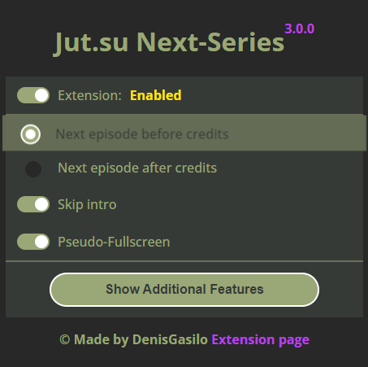
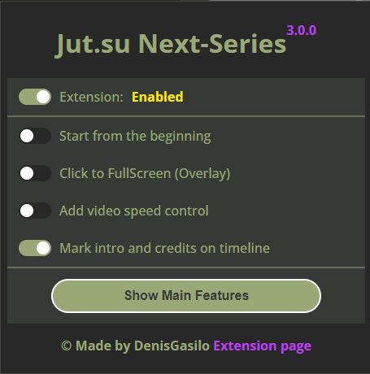
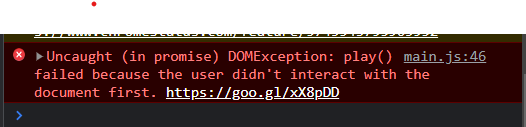

   
   <h1>jut.su Next-Series V3.0.0</h1>

   

## Description

Enhance your viewing experience on [Jut.su](https://jut.su/) with our extension that supports autoplay, skips anime intros automatically, and transitions seamlessly to the next episode.

## Features

- **Automatically Plays Video** ✅🎥
- **Automatically Skip Anime Intro** ⏩🎬
- **Pseudo-Fullscreen Mode** 🌐📺
- **Open Next Episode** 🚀🎞️
- **Video Hotkey Work (Press "F" to FullScreen)** 🖥️❤️
- **Mark Video Timeline** 📊🕓
- **Video Speed Control** ⏩⏪🎚️

## Installation

[Download from the Chrome Web Store](https://chromewebstore.google.com/detail/jutsu-next-series/godmnckhgkgojikjpiahppfnmhgkfpjp)

## Usage

### Mobile Support

Use the extension on your phone via the [Kiwi Browser](https://play.google.com/store/apps/details?id=com.kiwibrowser.browser&pcampaignid=web_share), which supports Chrome extensions.

### Settings Documentation

#### Main Settings

- 

- **Enable/Disable Extension**
   - **Toggle the entire extension on or off.**
   - **Type:** Checkbox

- **Next Series Before Credits**
   - **Automatically advance to the next episode before the current episode's credits roll.**
   - **Type:** Radio button

- **Next Series After Credits**
   - **Transition to the next episode after the credits finish.**
   - **Type:** Radio button

- **Skip Intro**
   - **Skip the intro of each episode automatically.**
   - **Type:** Checkbox

- **Pseudo-Fullscreen Mode**
   - **Activate a fullscreen experience without entering true fullscreen mode, enhancing focus on the video by hiding other elements.**
   - **Type:** Checkbox

#### Additional Settings

- 

- **Video from the Start**
   - **Begin every video from its start automatically.**
   - **Type:** Checkbox

- **Click to Fullscreen (Overlay)**
   - **Enter fullscreen mode with a single click on the video player for convenience.**
   - **Type:** Checkbox

- **Add Video Speed Control**
   - **Add a feature to adjust video playback speed according to user preference.**
   - **Type:** Checkbox

- **Mark Video Timeline**
   - **Place markers on the video timeline to easily identify and skip intros and credits.**
   - **Type:** Checkbox

## Planned Features

- **Firefox Compatibility** 🔬
- **Extended Localization** ✅
- **Customizable Shortcuts** ⚙️

The test tube emoji (🔬) signifies that the feature is currently being tested, which aligns well with the state of development you described.

## Known Issues

Check our [GitHub Issues page](https://github.com/DenisGas/jut.su_next-series/issues) for ongoing issues and report any new ones.

- **Autoplay Not Working on Reload**
    - **Issue:** Due to browser policies, autoplay may not work after reloading a page.
    - **Screenshot:** 
    - **Workaround:** Convert the site into a [PWA](https://support.google.com/chrome_webstore/answer/3060053#zippy=%2Cadd-an-app-from-the-chrome-web-store) to enable consistent autoplay functionality after restarts, tested on Chrome and Edge.

