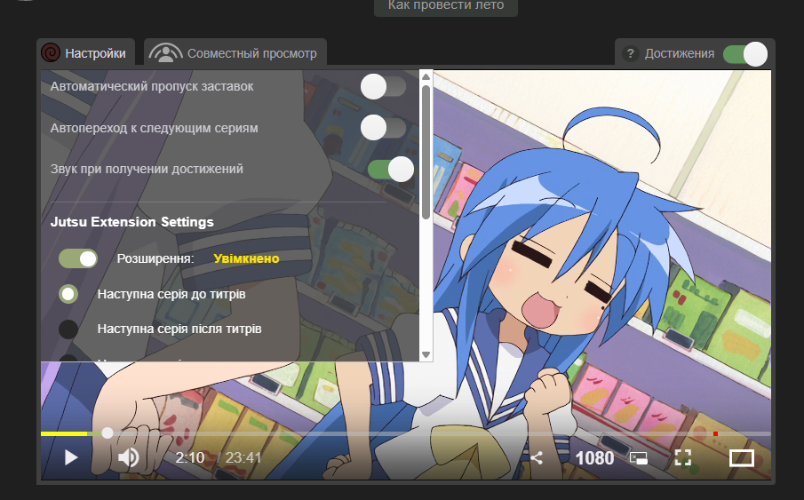
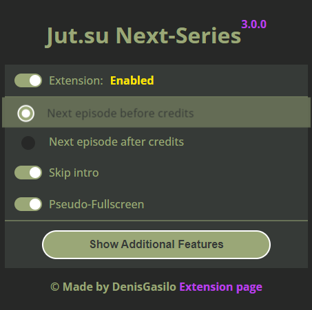
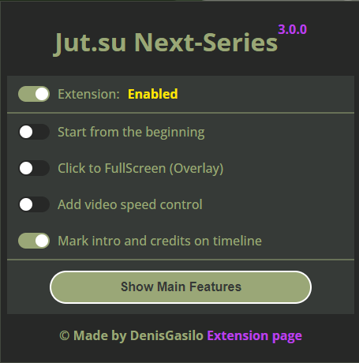
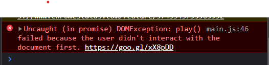

   
   <h1>jut.su Next-Series V3.1.0</h1>

## Description

Enhance your viewing experience on [Jut.su](https://jut.su/) with our extension that supports autoplay, automatically skips anime intros, and transitions seamlessly to the next episode.

## Features

- **Automatically Play Videos** ✅🎥
- **Automatically Skip Anime Intros** ⏩🎬
- **Pseudo-Fullscreen Mode** 🌐📺
- **Open Next Episode Automatically** 🚀🎞️
- **Video Hotkeys (Press "F" for Fullscreen)** 🖥️❤️
- **Mark Video Timeline** 📊🕓
- **Adjust Video Speed** ⏩⏪🎚️

## Installation

[Download from the Chrome Web Store](https://chromewebstore.google.com/detail/jutsu-next-series/godmnckhgkgojikjpiahppfnmhgkfpjp)

## Usage

### Mobile Support

Use the extension on your phone via the [Kiwi Browser](https://play.google.com/store/apps/details?id=com.kiwibrowser.browser&pcampaignid=web_share), which supports Chrome extensions.

### Settings Documentation

All settings are available in the **Page Settings**.

#### Main Settings

- 

- **Enable/Disable Extension**

  - Toggle the entire extension on or off.
  - **Type:** Checkbox

- **Next Series Before Credits**

  - Automatically advance to the next episode before the current episode's credits.
  - **Type:** Radio button

- **Next Series After Credits**

  - Automatically advance to the next episode after credits.
  - **Type:** Radio button

- **Next Series Off**

  - Disable automatic episode transition.
  - **Type:** Radio button

- **Skip Intro**

  - Automatically skip the intro of each episode.
  - **Type:** Checkbox

- **Fix Skip Intro**

  - Use if the standard Skip Intro feature does not work properly.
  - **Type:** Checkbox

- **Pseudo-Fullscreen Mode**
  - Activate fullscreen experience without true fullscreen, hiding other elements to focus on the video.
  - **Type:** Checkbox

#### Additional Settings

- 

- **Video From Start**

  - Automatically start each video from the beginning.
  - **Type:** Checkbox

- **Click to Fullscreen (Overlay)**

  - Enter fullscreen mode by clicking on the video player.
  - **Type:** Checkbox

- **Add Video Speed Control**

  - Add a feature to adjust video playback speed.
  - **Type:** Checkbox

- **Mark Video Timeline**
  - Mark intros and credits on the video timeline for easier navigation.
  - **Type:** Checkbox

## Planned Features

- **Firefox Compatibility** 🔬
- **Extended Localization** ✅
- **Customizable Shortcuts** ⚙️

The test tube emoji (🔬) indicates features in testing.

## Known Issues

Check our [GitHub Issues page](https://github.com/DenisGas/jut.su_next-series/issues) for ongoing issues and to report new ones.

- **Autoplay Not Working on Reload**

  - **Issue:** Browser policies may prevent autoplay after page reload.
  - **Workaround:** Install the site as a [PWA](https://support.google.com/chrome_webstore/answer/3060053#zippy=%2Cadd-an-app-from-the-chrome-web-store) to enable consistent autoplay on Chrome/Edge.
  - **Screenshot:**

    
